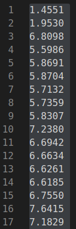

作业1.  

Q1: 代码基本补全，执行一直不收敛，暂时没找不到原因。  

Q2 由于Q1的问题，导致Q2无法实际比较区别。 从grid设置的作用可以看出其是为了稀疏且均匀化提取的fast点，同时保证grid栅格内选点是相应最好的点。

作业2：  ORB和DSO两个系统, 关键帧筛选策略： 添加关键帧主要是避免当前帧与参考帧变化过大，导致跟踪丢失，前端失效。

DSO的策略是初始化大量关键帧之后通过边缘化掉冗余帧将关键帧变的稀疏，判断关键帧的三种情况为：
（1）视角转变时创建关键帧，主要通过在初始化粗略跟踪阶段测量均方光流，判断是否转向
（2）在导致遮挡和减少遮挡处，这里主要通过没有旋转的平均光流进行计算
（3）相机曝光时间变化明显时，这主要通过两帧之间的相对亮度因子来测量

ORB-SLAM中创建关键帧：
1) 很长时间没有插入关键帧、局部地图空闲、跟踪快要跪
2)  跟踪地图MapPoints的比例比较少